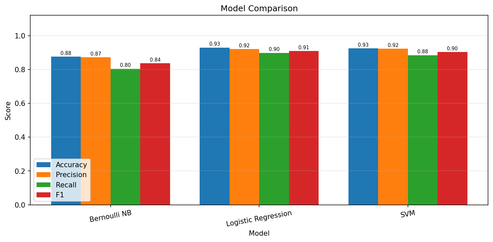
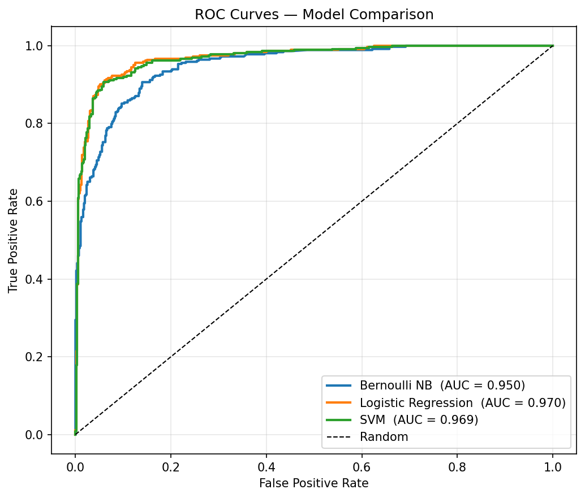
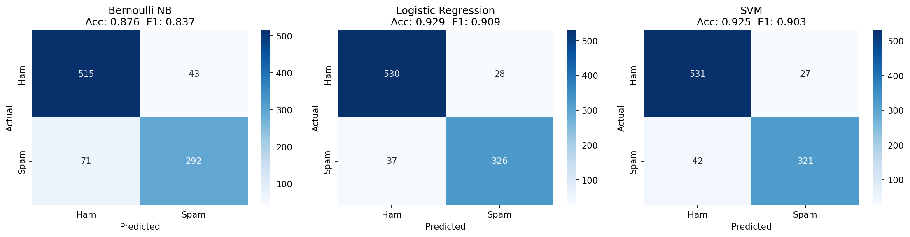
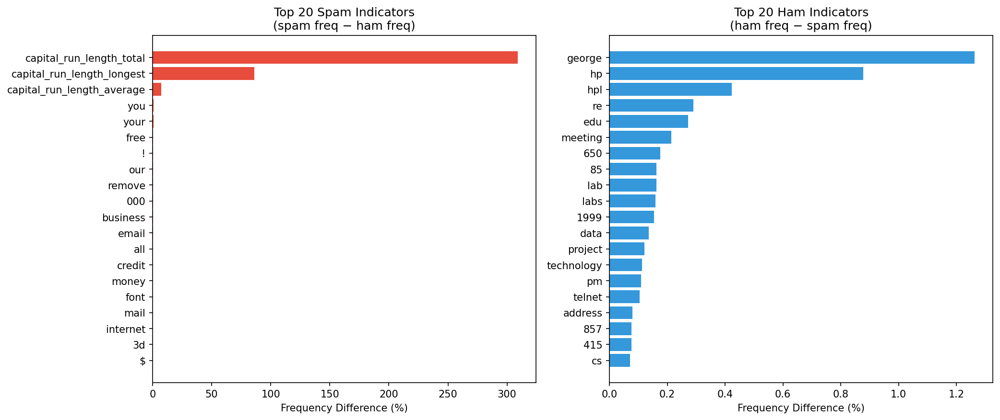

# Spam Email Detector Using NLP

A machine learning project that leverages Natural Language Processing (NLP) techniques to accurately identify and classify spam emails. Developed as part of CS5002 at Northeastern University.

## 📋 Table of Contents

- [Overview](#overview)
- [Features](#features)
- [Project Structure](#project-structure)
- [Installation](#installation)
- [Usage](#usage)
- [Methodology](#methodology)
- [Model Evaluation](#model-evaluation)
- [Data Analysis](#data-analysis)
- [Built With](#built-with)
- [Testing](#testing)
- [Contributing](#contributing)
- [License](#license)
- [Authors](#authors)

## Overview

This project implements a spam email detection system using Natural Language Processing (NLP) and machine learning. By leveraging the Multinomial Naive Bayes algorithm, the model automatically classifies emails as spam or legitimate (ham) based on their content, helping users maintain clean and secure inboxes.

## Features

- **Text Preprocessing**: Tokenization and normalization of email content
- **Feature Extraction**: Bag of Words (BoW) representation using CountVectorizer
- **Multi-Model Comparison**: Benchmarks Bernoulli Naive Bayes, Logistic Regression, and SVM side by side
- **Manual Naive Bayes**: Hand-rolled Bayesian classifier with log-space arithmetic and Laplace smoothing
- **Model Evaluation**: Comprehensive performance metrics including:
  - Accuracy
  - Precision
  - Recall
  - F1 Score
  - AUC-ROC
  - 5-fold Cross-Validation
- **Visualizations**: Confusion matrices, ROC curves, top spam/ham word charts, and model comparison bar chart — saved to `plots/`
- **CLI**: Classify any raw email string directly from the command line
- **Flexible Data Handling**: Support for multiple file encodings (UTF-8, ISO-8859-1, Latin-1)
- **Easy Integration**: Modular code structure for easy extension and customization

## Project Structure

```
Spambase/
├── main.py                  # Entry point: model comparison, visualizations, CLI
├── beyes.py                 # Naive Bayes training and classification functions
├── configuration.py         # Configuration, constants, and imports
├── helper.py                # Utility functions for file operations and text processing
├── data_import.py           # Manual Naive Bayes implementation (fixed)
├── visualizations.py        # Plot generation (confusion matrices, ROC, word charts)
├── requirements.txt         # Python dependencies
├── tests/                   # Unit tests
│   └── test_spam_filter.py
├── plots/                   # Auto-generated visualizations
│   ├── confusion_matrices.png
│   ├── roc_curves.png
│   ├── model_comparison.png
│   └── top_spam_ham_words.png
├── assets/                  # Project assets
│   └── images/              # Visualization images
├── spambase/                # Dataset directory
│   ├── spambase.data        # Spam dataset
│   ├── spambase.DOCUMENTATION
│   └── spambase.names
└── test database/           # Test email dataset
    ├── ham/                 # Legitimate emails
    └── spam/                # Spam emails
```

## Installation

### Prerequisites

- Python 3.7 or higher
- pip (Python package manager)

### Setup

1. Clone the repository:
```bash
git clone <repository-url>
cd Spambase
```

2. Install required dependencies:
```bash
pip install -r requirements.txt
```

3. (Optional) Download NLTK data if needed:
```python
import nltk
nltk.download('punkt')
```

## Usage

### Run All Models

Train and compare all models, print results, and save visualizations to `plots/`:

```bash
python main.py
```

### Classify a Single Email (CLI)

```bash
python main.py --email "Congratulations! You've won a FREE prize. Claim now!"
```

Output:
```
Result:           SPAM
Spam probability: 100.0%
```

### Skip Plot Generation

```bash
python main.py --no-plots
```

### Basic Usage (Programmatic)

Train and evaluate the spam detection model on raw email text:

```python
from beyes import spam_filter_train
from helper import get_files_path

# Load email data
ham_folder_path = './test database/ham'
spam_folder_path = './test database/spam'
ham_files_path = get_files_path(ham_folder_path)
spam_files_path = get_files_path(spam_folder_path)

# Prepare data
X = []
Y = []
for file_path in ham_files_path:
    with open(file_path, 'r', encoding='latin-1') as file:
        X.append(file.read())
        Y.append(0)  # 0 for ham

for file_path in spam_files_path:
    with open(file_path, 'r', encoding='latin-1') as file:
        X.append(file.read())
        Y.append(1)  # 1 for spam

# Train the model
clf, vectorizer = spam_filter_train(X, Y)
```

## Methodology

The project follows a standard machine learning pipeline:

1. **Data Collection**: Uses the Spambase dataset and a custom test database with labeled ham and spam emails.

2. **Dataset Splitting**: Divides data into training (75%) and testing (25%) subsets for model evaluation.

3. **Feature Extraction**: Converts text to numerical features using word frequencies via `CountVectorizer()`, creating a matrix where rows represent documents and columns represent unique terms.


4. **Model Training**: Trains a Multinomial Naive Bayes classifier on vectorized text data to learn probability distributions of words in spam vs ham emails.


### How Naive Bayes Works

Naive Bayes uses Bayes' theorem to calculate `P(spam|words)` and `P(ham|words)`, then classifies based on the higher probability.


**Training Steps:**

1. **Prior Probabilities**: Calculate `P(spam)` and `P(ham)` from training data distribution.


2. **Word Probabilities**: Learn conditional probabilities `P(word|spam)` and `P(word|ham)` by counting word frequencies.


3. **Classification**: For new emails, multiply word probabilities and compare `P(spam|words)` vs `P(ham|words)`.


5. **Evaluation**: Assess performance using accuracy, precision, and recall metrics.

## Model Evaluation

Evaluated on 1,035 test emails (286 spam, 749 ham), the model achieved **97% precision** and **95% recall**.

### Classification Process


### Confusion Matrix


**Results:** True Spam: 273 | True Ham: 740 | False Spam: 9 | False Ham: 13

### Performance Metrics


### Multi-Model Comparison (Spambase Dataset — 4,601 emails)

| Model | Accuracy | Precision | Recall | F1 | AUC-ROC | CV Accuracy |
|---|---|---|---|---|---|---|
| Manual Naive Bayes | 0.8243 | 0.6950 | 0.9890 | 0.8163 | — | — |
| Bernoulli NB | 0.8762 | 0.8716 | 0.8044 | 0.8367 | 0.9496 | 0.8868 ± 0.0081 |
| Logistic Regression | 0.9294 | 0.9209 | 0.8981 | 0.9093 | 0.9702 | 0.9246 ± 0.0068 |
| SVM | 0.9251 | 0.9224 | 0.8843 | 0.9030 | 0.9688 | 0.9213 ± 0.0062 |







## Data Analysis

Word frequency analysis reveals that keywords like "win", "free", and "money" appear more frequently in spam emails, enabling the classifier to distinguish between spam and legitimate messages.




## Built With

- **Python** - The core programming language
- **Scikit-learn** - Machine learning library for modeling and evaluation
- **NLTK** - Natural Language Processing library for text preprocessing
- **Pandas** - Data manipulation and analysis
- **NumPy** - Numerical computing
- **Matplotlib** - Visualization and plot generation
- **Seaborn** - Statistical data visualization

## Testing

Unit tests cover feature extraction correctness and the manual Naive Bayes implementation.

```bash
pytest tests/
```

```
16 passed in 1.55s
```

## Contributing

This project is part of coursework for CS5002 at Northeastern University. Contributions are welcome!

1. Fork the repository
2. Create a feature branch (`git checkout -b feature/AmazingFeature`)
3. Commit your changes (`git commit -m 'Add some AmazingFeature'`)
4. Push to the branch (`git push origin feature/AmazingFeature`)
5. Open a Pull Request

For bug reports or suggestions, please open an issue.

## License

This project is licensed under the MIT License - see the [LICENSE](LICENSE) file for details.

## Authors

- **Kaustubha Eluri** 
  - [GitHub](https://github.com/Kaustubha-09/)
  - [Portfolio](https://kaustubha-09.github.io)
  - [LinkedIn](https://linkedin.com/in/kaustubha-ve)
  - Email: kaustubha.ev@gmail.com

---

*Developed as part of CS5002 at Northeastern University*
