# Spam Email Detector Using NLP

A machine learning project that leverages Natural Language Processing (NLP) techniques to accurately identify and classify spam emails. Developed as part of CS5002 at Northeastern University.

## 📋 Table of Contents

- [Overview](#overview)
- [Features](#features)
- [Project Structure](#project-structure)
- [Installation](#installation)
- [Usage](#usage)
- [Methodology](#methodology)
- [Model Evaluation](#model-evaluation)
- [Data Analysis](#data-analysis)
- [Built With](#built-with)
- [Contributing](#contributing)
- [License](#license)
- [Authors](#authors)

## Overview

The rise of digital communication has brought with it a significant increase in unwanted emails, commonly known as spam. These irrelevant or inappropriate messages clutter inboxes and may contain harmful links or scams. This project tackles this issue by building a machine learning model that can automatically classify emails as spam or legitimate (ham) based on their content.

The project implements a Naive Bayes classifier using the Multinomial Naive Bayes algorithm, which is particularly well-suited for text classification tasks. The model is trained on a dataset of labeled emails and evaluated using standard classification metrics.

## Features

- **Text Preprocessing**: Tokenization and normalization of email content
- **Feature Extraction**: Bag of Words (BoW) representation using CountVectorizer
- **Machine Learning Model**: Multinomial Naive Bayes classifier for spam detection
- **Model Evaluation**: Comprehensive performance metrics including:
  - Accuracy
  - Precision
  - Recall
  - F1 Score
- **Flexible Data Handling**: Support for multiple file encodings (UTF-8, ISO-8859-1, Latin-1)
- **Easy Integration**: Modular code structure for easy extension and customization

## Project Structure

```
Spambase/
├── beyes.py                 # Naive Bayes training and classification functions
├── configuration.py         # Configuration and imports
├── helper.py                # Utility functions for file operations and text processing
├── data_import_xinrui.py    # Data preprocessing and analysis scripts
├── yang_main.py             # Main execution script for email classification
├── test.py                  # Test script for model evaluation
├── assets/                  # Project assets
│   └── images/              # Visualization images
├── spambase/                # Dataset directory
│   ├── spambase.data        # Spam dataset
│   ├── spambase.DOCUMENTATION
│   └── spambase.names
└── test database/           # Test email dataset
    ├── ham/                 # Legitimate emails
    └── spam/                # Spam emails
```

## Installation

### Prerequisites

- Python 3.7 or higher
- pip (Python package manager)

### Setup

1. Clone the repository:
```bash
git clone <repository-url>
cd Spambase
```

2. Install required dependencies:
```bash
pip install scikit-learn nltk pandas numpy
```

3. (Optional) Download NLTK data if needed:
```python
import nltk
nltk.download('punkt')
```

## Usage

### Basic Usage

Train and evaluate the spam detection model:

```python
from beyes import spam_filter_train
from helper import get_files_path

# Load email data
ham_folder_path = './test database/ham'
spam_folder_path = './test database/spam'
ham_files_path = get_files_path(ham_folder_path)
spam_files_path = get_files_path(spam_folder_path)

# Prepare data
X = []
Y = []
for file_path in ham_files_path:
    with open(file_path, 'r', encoding='latin-1') as file:
        X.append(file.read())
        Y.append(0)  # 0 for ham

for file_path in spam_files_path:
    with open(file_path, 'r', encoding='latin-1') as file:
        X.append(file.read())
        Y.append(1)  # 1 for spam

# Train the model
clf, vectorizer = spam_filter_train(X, Y)
```

### Running the Test Script

```bash
python test.py
```

## Methodology

1. **Data Collection**: The project uses the Spambase dataset and a custom test database containing labeled ham and spam emails.

2. **Dataset Splitting**: The dataset is divided into training (75%) and testing (25%) subsets. The testing subset serves as an independent dataset that wasn't seen during training, allowing us to assess how well the model generalizes to new, unseen data.

3. **Feature Extraction**: Text data is converted into numerical features using word frequencies. The `CountVectorizer()` from scikit-learn tokenizes the input text and counts word occurrences, creating a matrix where each row represents a document and each column represents a unique term.

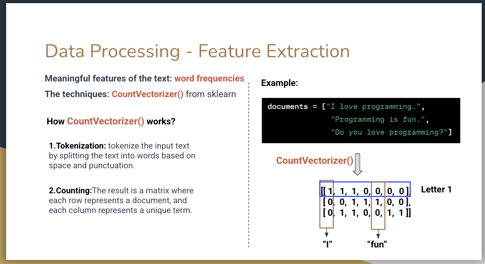

4. **Model Training**: 
   - Multinomial Naive Bayes classifier is trained on the vectorized text data
   - The model learns the probability distributions of words in spam vs ham emails

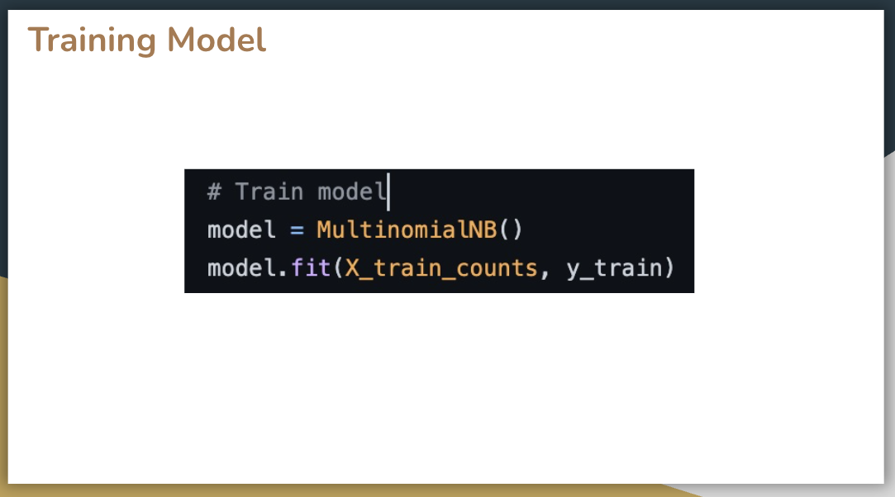

### How Naive Bayes Classification Works

The Naive Bayes algorithm uses Bayes' theorem to calculate the probability that an email is spam or ham given the words it contains. The model compares `P(spam|words)` and `P(ham|words)` to make its classification decision.

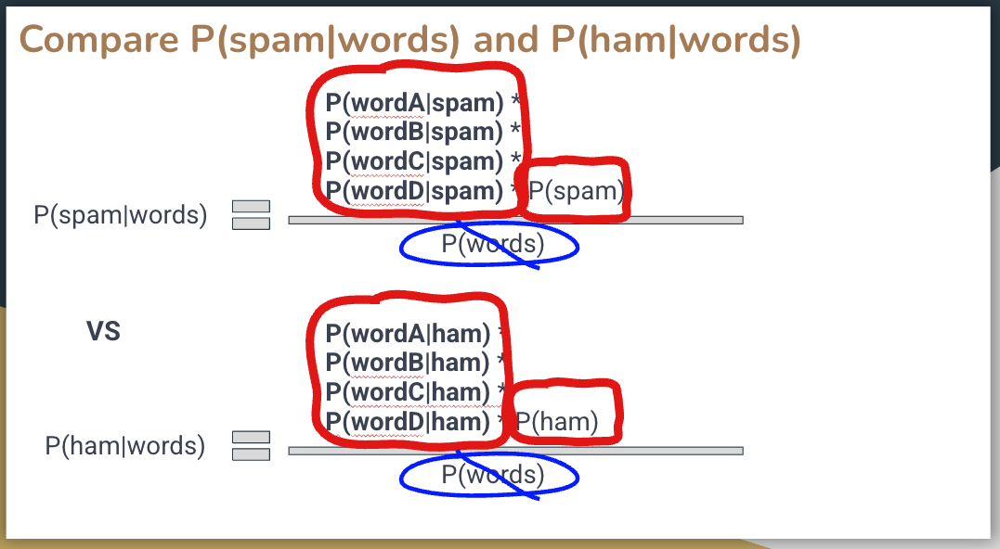

**Training Process:**

1. **Prior Probabilities**: The model first calculates the prior probabilities of spam and ham emails in the training dataset.

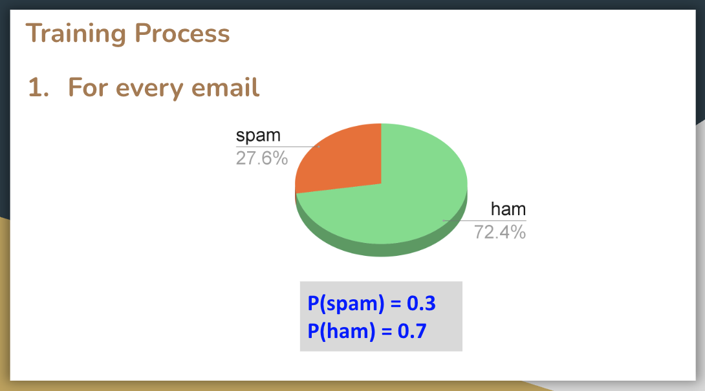

2. **Word Probabilities**: For each word in the vocabulary, the model learns the conditional probabilities `P(word|spam)` and `P(word|ham)` by counting word frequencies in spam and ham emails.

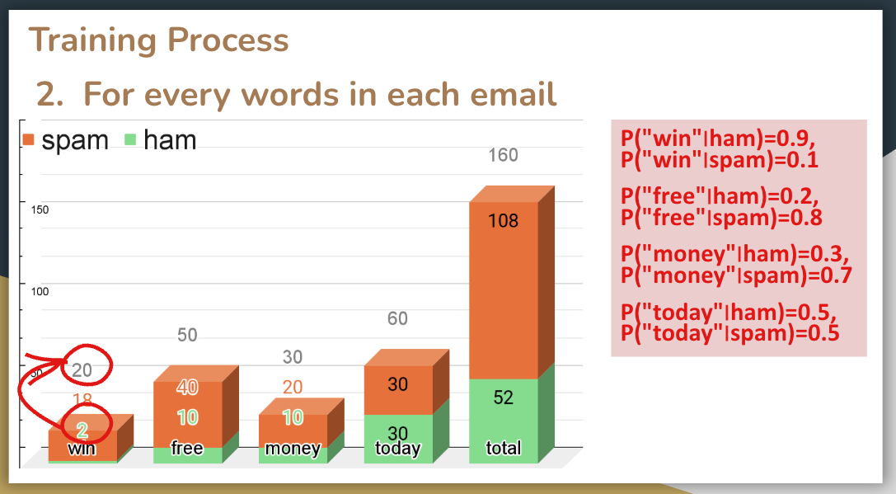

3. **Classification**: When classifying a new email, the model multiplies the word probabilities and compares `P(spam|words)` vs `P(ham|words)`. The class with the higher probability is chosen.

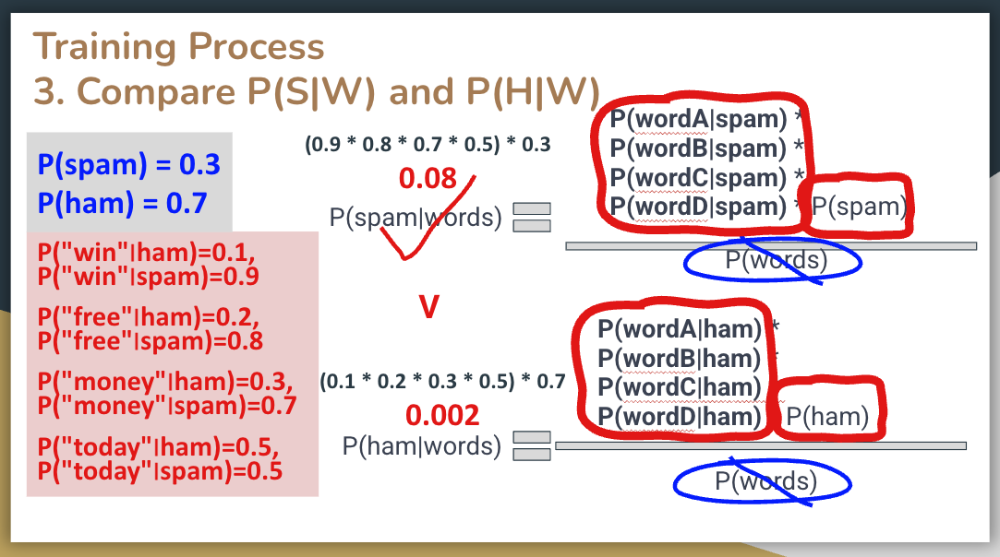

5. **Evaluation**: Model performance is assessed using accuracy, precision, and recall metrics.

## Model Evaluation

The Naive Bayes classifier was evaluated on a test dataset of 1,035 emails (286 spam, 749 ham). The model achieved **97% precision** and **95% recall**, demonstrating strong performance in distinguishing between spam and legitimate emails.

### Classification Process

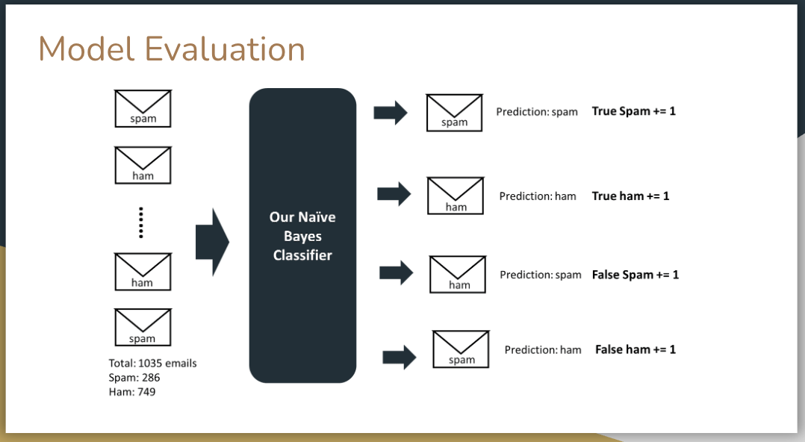

### Confusion Matrix

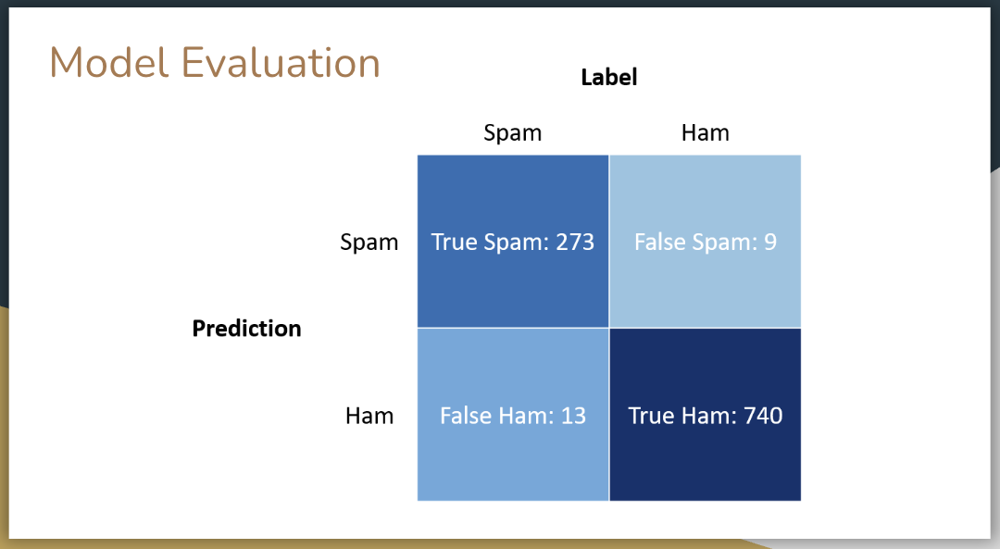

**Results:**
- **True Spam:** 273 | **True Ham:** 740
- **False Spam:** 9 | **False Ham:** 13

### Performance Metrics

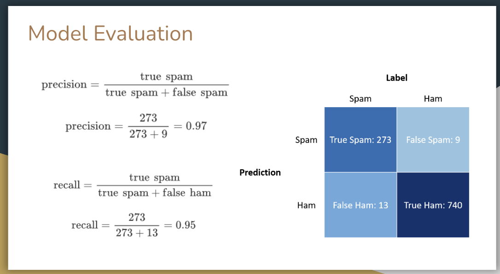

## Data Analysis

The following visualizations demonstrate the word frequency analysis for spam vs ham emails. These charts help illustrate how certain keywords are more prevalent in spam messages compared to legitimate emails.

### Word Frequency Analysis

The table and chart below show the occurrence counts of key words ("win", "free", "money", "today") in both spam and ham email categories:

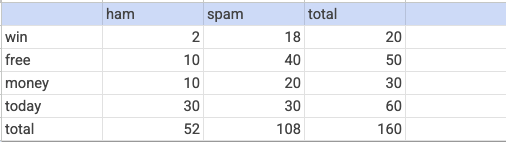

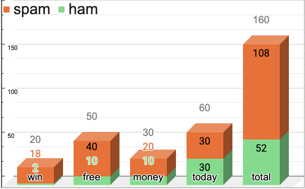

These visualizations demonstrate that words like "win", "free", and "money" appear more frequently in spam emails, which helps the Naive Bayes classifier distinguish between spam and legitimate messages.

## Built With

- **Python** - The core programming language
- **Scikit-learn** - Machine learning library for modeling and evaluation
- **NLTK** - Natural Language Processing library for text preprocessing
- **Pandas** - Data manipulation and analysis
- **NumPy** - Numerical computing

## Contributing

This project is part of coursework for CS5002 at Northeastern University. Contributions and suggestions are welcome! 

To contribute:
1. Fork the repository
2. Create a feature branch (`git checkout -b feature/AmazingFeature`)
3. Commit your changes (`git commit -m 'Add some AmazingFeature'`)
4. Push to the branch (`git push origin feature/AmazingFeature`)
5. Open a Pull Request

For bug reports or enhancement suggestions, please open an issue with appropriate tags.

## License

This project is licensed under the MIT License - see the [LICENSE](LICENSE) file for details.

## Authors

- **Kaustubha** - [GitHub](https://github.com/Kaustubha-09/)

---

*Developed as part of CS5002 at Northeastern University*
