# Spam Email Detector Using NLP

A machine learning project that leverages Natural Language Processing (NLP) techniques to accurately identify and classify spam emails. Developed as part of CS5002 at Northeastern University.

## 📋 Table of Contents

- [Overview](#overview)
- [Features](#features)
- [Project Structure](#project-structure)
- [Installation](#installation)
- [Usage](#usage)
- [Methodology](#methodology)
- [Model Evaluation](#model-evaluation)
- [Data Analysis](#data-analysis)
- [Built With](#built-with)
- [Testing](#testing)
- [Contributing](#contributing)
- [License](#license)
- [Authors](#authors)

## Overview

This project implements a spam email detection system using Natural Language Processing (NLP) and machine learning. By leveraging the Multinomial Naive Bayes algorithm, the model automatically classifies emails as spam or legitimate (ham) based on their content, helping users maintain clean and secure inboxes.

## Features

- **Text Preprocessing**: Tokenization and normalization of email content
- **Feature Extraction**: Bag of Words (BoW) representation using CountVectorizer
- **Multi-Model Comparison**: Benchmarks Bernoulli Naive Bayes, Logistic Regression, and SVM side by side
- **Manual Naive Bayes**: Hand-rolled Bayesian classifier with log-space arithmetic and Laplace smoothing
- **Model Evaluation**: Comprehensive performance metrics including:
  - Accuracy
  - Precision
  - Recall
  - F1 Score
  - AUC-ROC
  - 5-fold Cross-Validation
- **Visualizations**: Confusion matrices, ROC curves, top spam/ham word charts, and model comparison bar chart — saved to `plots/`
- **CLI**: Classify any raw email string directly from the command line
- **Flexible Data Handling**: Support for multiple file encodings (UTF-8, ISO-8859-1, Latin-1)
- **Easy Integration**: Modular code structure for easy extension and customization

## Project Structure

```
Spambase/
├── main.py                  # Entry point: model comparison, visualizations, CLI
├── beyes.py                 # Naive Bayes training and classification functions
├── configuration.py         # Configuration, constants, and imports
├── helper.py                # Utility functions for file operations and text processing
├── data_import.py           # Manual Naive Bayes implementation (fixed)
├── visualizations.py        # Plot generation (confusion matrices, ROC, word charts)
├── requirements.txt         # Python dependencies
├── tests/                   # Unit tests
│   └── test_spam_filter.py
├── plots/                   # Auto-generated visualizations
│   ├── confusion_matrices.png
│   ├── roc_curves.png
│   ├── model_comparison.png
│   └── top_spam_ham_words.png
├── assets/                  # Project assets
│   └── images/              # Visualization images
├── spambase/                # Dataset directory
│   ├── spambase.data        # Spam dataset
│   ├── spambase.DOCUMENTATION
│   └── spambase.names
└── test database/           # Test email dataset
    ├── ham/                 # Legitimate emails
    └── spam/                # Spam emails
```

## Installation

### Prerequisites

- Python 3.7 or higher
- pip (Python package manager)

### Setup

1. Clone the repository:
```bash
git clone <repository-url>
cd Spambase
```

2. Install required dependencies:
```bash
pip install -r requirements.txt
```

3. (Optional) Download NLTK data if needed:
```python
import nltk
nltk.download('punkt')
```

## Usage

### Run All Models

Train and compare all models, print results, and save visualizations to `plots/`:

```bash
python main.py
```

### Classify a Single Email (CLI)

```bash
python main.py --email "Congratulations! You've won a FREE prize. Claim now!"
```

Output:
```
Result:           SPAM
Spam probability: 100.0%
```

### Skip Plot Generation

```bash
python main.py --no-plots
```

### Basic Usage (Programmatic)

Train and evaluate the spam detection model on raw email text:

```python
from beyes import spam_filter_train
from helper import get_files_path

# Load email data
ham_folder_path = './test database/ham'
spam_folder_path = './test database/spam'
ham_files_path = get_files_path(ham_folder_path)
spam_files_path = get_files_path(spam_folder_path)

# Prepare data
X = []
Y = []
for file_path in ham_files_path:
    with open(file_path, 'r', encoding='latin-1') as file:
        X.append(file.read())
        Y.append(0)  # 0 for ham

for file_path in spam_files_path:
    with open(file_path, 'r', encoding='latin-1') as file:
        X.append(file.read())
        Y.append(1)  # 1 for spam

# Train the model
clf, vectorizer = spam_filter_train(X, Y)
```

## Methodology

The project follows a standard machine learning pipeline:

1. **Data Collection**: Uses the Spambase dataset and a custom test database with labeled ham and spam emails.

2. **Dataset Splitting**: Divides data into training (75%) and testing (25%) subsets for model evaluation.

3. **Feature Extraction**: Converts text to numerical features using word frequencies via `CountVectorizer()`, creating a matrix where rows represent documents and columns represent unique terms.

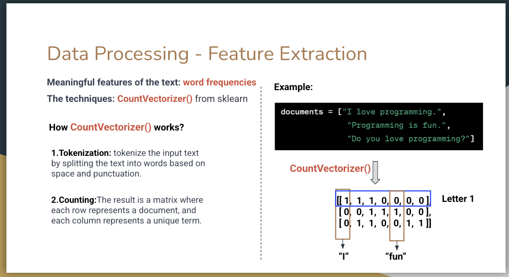

4. **Model Training**: Trains a Multinomial Naive Bayes classifier on vectorized text data to learn probability distributions of words in spam vs ham emails.

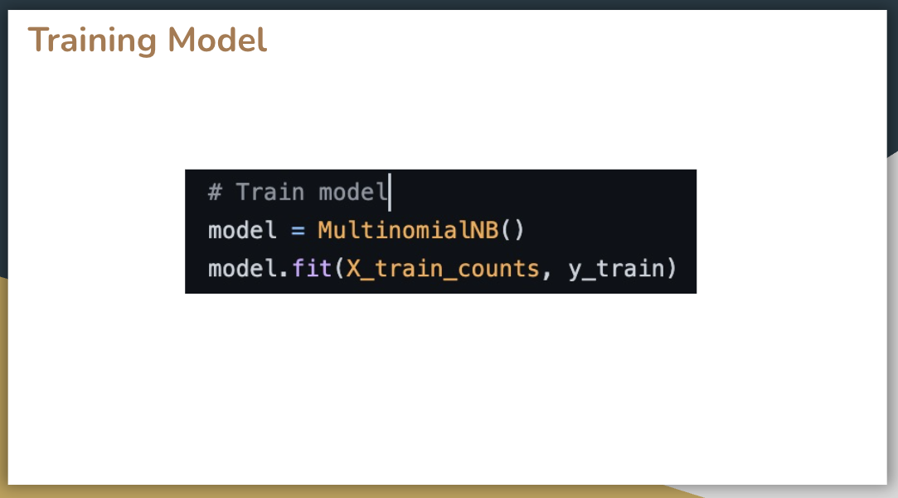

### How Naive Bayes Works

Naive Bayes uses Bayes' theorem to calculate `P(spam|words)` and `P(ham|words)`, then classifies based on the higher probability.

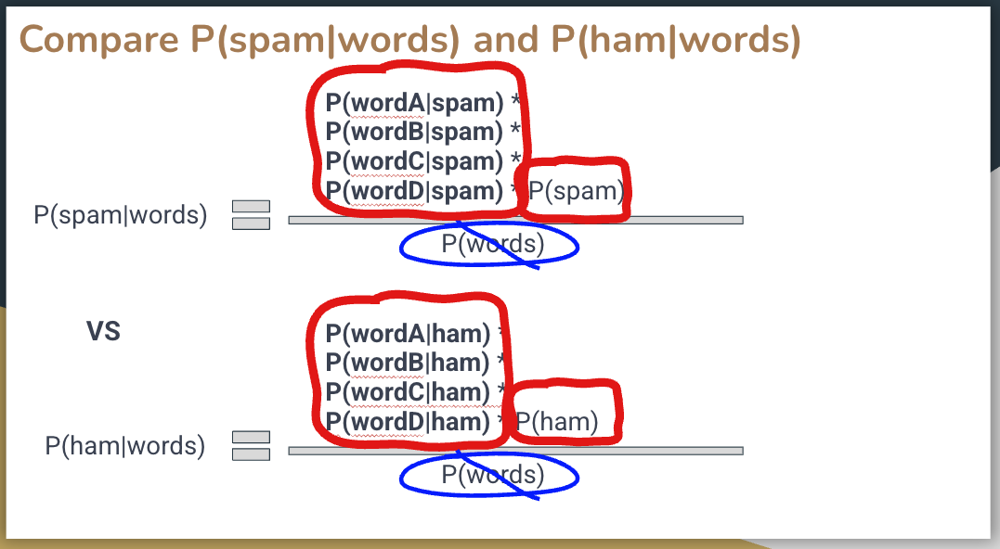

**Training Steps:**

1. **Prior Probabilities**: Calculate `P(spam)` and `P(ham)` from training data distribution.

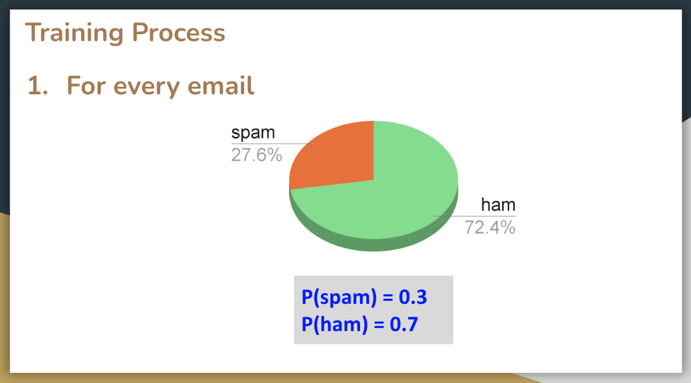

2. **Word Probabilities**: Learn conditional probabilities `P(word|spam)` and `P(word|ham)` by counting word frequencies.

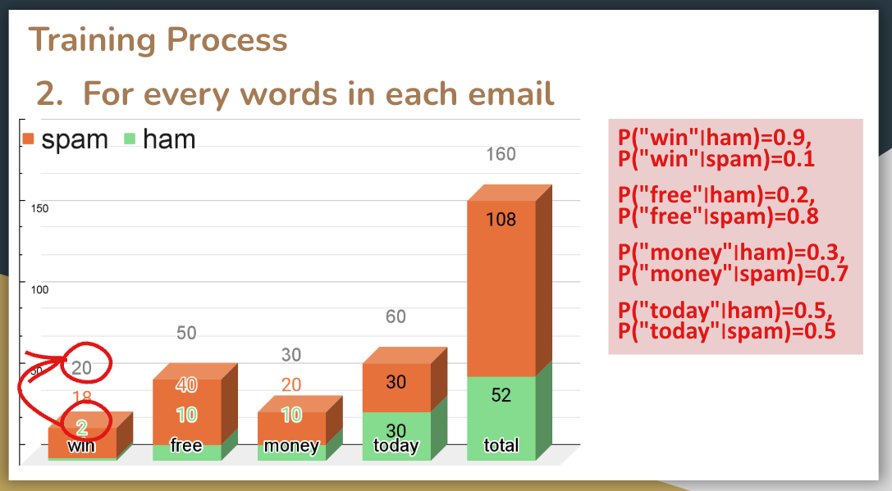

3. **Classification**: For new emails, multiply word probabilities and compare `P(spam|words)` vs `P(ham|words)`.

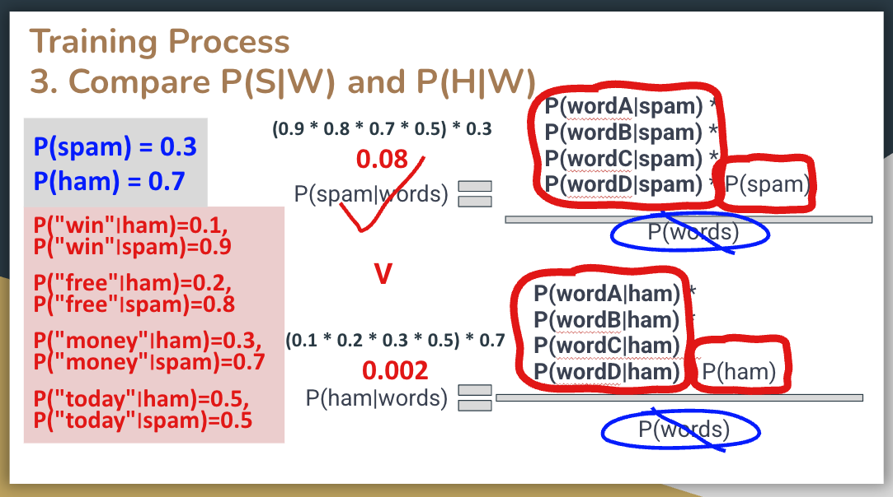

5. **Evaluation**: Assess performance using accuracy, precision, and recall metrics.

## Model Evaluation

Evaluated on 1,035 test emails (286 spam, 749 ham), the model achieved **97% precision** and **95% recall**.

### Classification Process

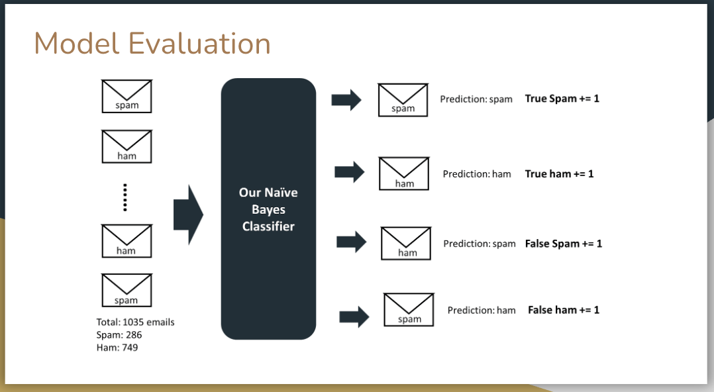

### Confusion Matrix

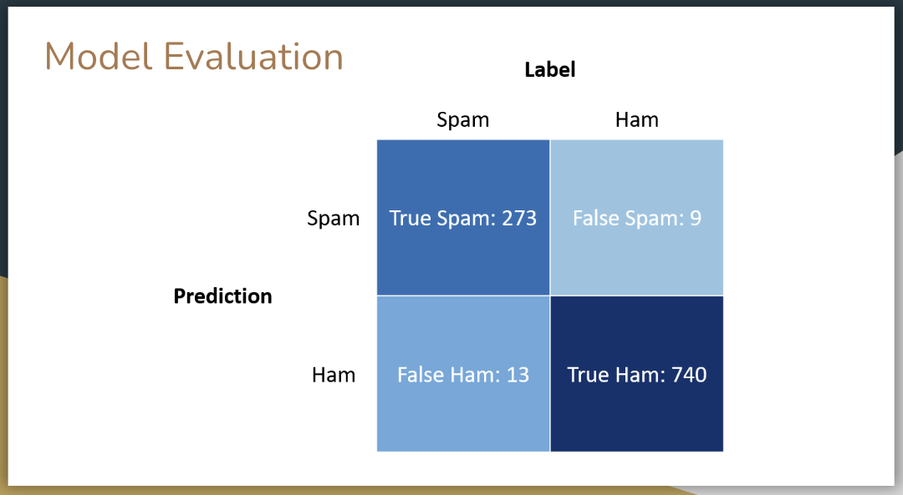

**Results:** True Spam: 273 | True Ham: 740 | False Spam: 9 | False Ham: 13

### Performance Metrics

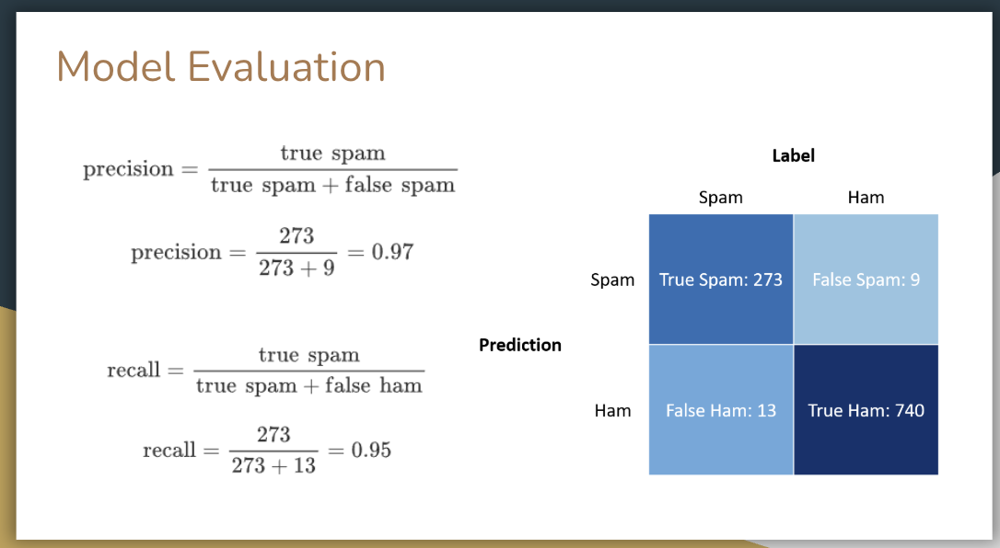

### Multi-Model Comparison (Spambase Dataset — 4,601 emails)

| Model | Accuracy | Precision | Recall | F1 | AUC-ROC | CV Accuracy |
|---|---|---|---|---|---|---|
| Manual Naive Bayes | 0.8243 | 0.6950 | 0.9890 | 0.8163 | — | — |
| Bernoulli NB | 0.8762 | 0.8716 | 0.8044 | 0.8367 | 0.9496 | 0.8868 ± 0.0081 |
| Logistic Regression | 0.9294 | 0.9209 | 0.8981 | 0.9093 | 0.9702 | 0.9246 ± 0.0068 |
| SVM | 0.9251 | 0.9224 | 0.8843 | 0.9030 | 0.9688 | 0.9213 ± 0.0062 |

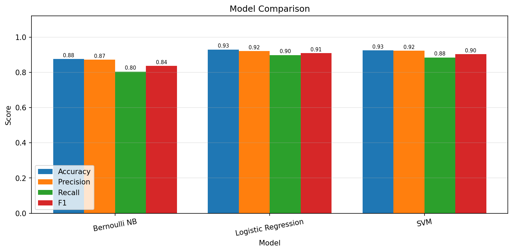

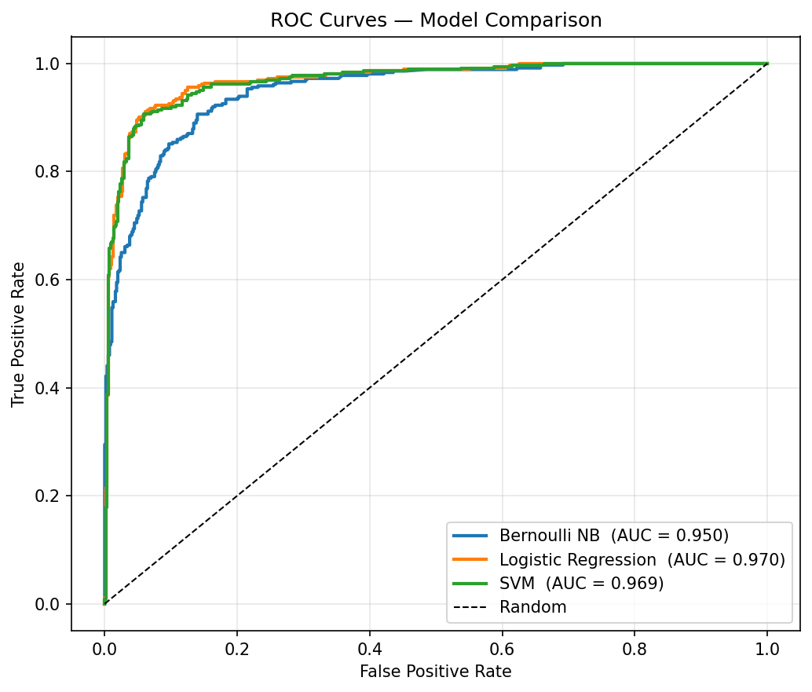

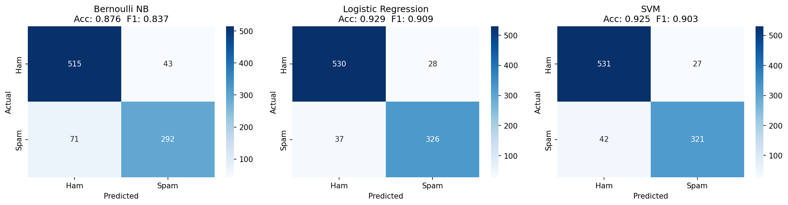

## Data Analysis

Word frequency analysis reveals that keywords like "win", "free", and "money" appear more frequently in spam emails, enabling the classifier to distinguish between spam and legitimate messages.

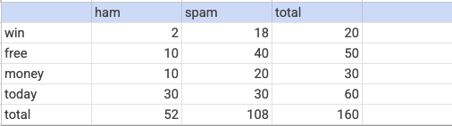

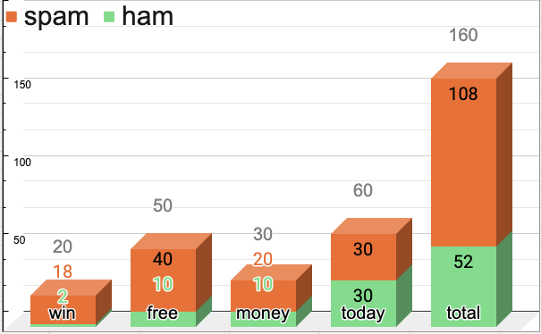

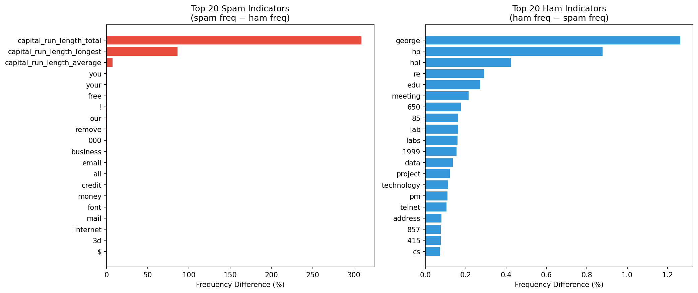

## Built With

- **Python** - The core programming language
- **Scikit-learn** - Machine learning library for modeling and evaluation
- **NLTK** - Natural Language Processing library for text preprocessing
- **Pandas** - Data manipulation and analysis
- **NumPy** - Numerical computing
- **Matplotlib** - Visualization and plot generation
- **Seaborn** - Statistical data visualization

## Testing

Unit tests cover feature extraction correctness and the manual Naive Bayes implementation.

```bash
pytest tests/
```

```
16 passed in 1.55s
```

## Tradeoffs

- **Two datasets, two model paths.** Spambase (engineered features) for the comparison study, raw .txt corpus for the end-to-end NB pipeline. Each demonstrates a different thing. See [docs/decisions.md, ADR-001](docs/decisions.md#adr-001--two-datasets-two-model-paths).
- **Hand-rolled Naive Bayes alongside scikit-learn.** `data_import.py` implements NB by hand — the algorithm is the lesson. Hidden behind `clf.fit(X, y)` it disappears. See [ADR-002](docs/decisions.md#adr-002--hand-rolled-naive-bayes-alongside-scikit-learn).
- **Log-space arithmetic** in the hand-rolled NB so multiplying ~10,000 token probabilities doesn't underflow. See [ADR-003](docs/decisions.md#adr-003--log-space-probability-arithmetic).
- **Laplace `α=1` smoothing** so an unseen word doesn't force the posterior to zero. See [ADR-004](docs/decisions.md#adr-004--laplace-add-one-smoothing).
- **Multi-model comparison, not a single winner.** Each model makes a different precision/recall tradeoff. The right model depends on what kind of error is worse. See [ADR-006](docs/decisions.md#adr-006--multi-model-comparison-rather-than-one-winning-model).
- **Plots saved to disk, never `plt.show()`.** Headless-safe for CI; PNGs are referenceable from the README.

Full ADR set in [docs/decisions.md](docs/decisions.md). Limitations in [docs/limitations.md](docs/limitations.md).

---

## Quality Gates

- `pytest tests/` — 16 unit tests covering vectorization output, manual NB log-prob arithmetic, file loading with encoding fallback.
- `python -m py_compile` on every source file — `main.py`, `beyes.py`, `configuration.py`, `data_import.py`, `helper.py`, `visualizations.py`.
- `python main.py` runs the full multi-model pipeline + saves all 4 plots to `plots/`.
- `python main.py --email "..."` returns a classification + spam probability in under a second.
- Train/test split is fixed (`test_size=0.25`, `random_state=42`) for reproducibility.
- Tests do **not** assert specific accuracy numbers — sklearn version drift would make those flaky.

---

## Project Stats

- **7** Python source files (`main.py`, `beyes.py`, `configuration.py`, `data_import.py`, `helper.py`, `visualizations.py`, `test.py`)
- **16** pytest unit tests
- **4** models compared (Manual NB · Bernoulli NB · Logistic Regression · SVM)
- **4** auto-generated plots (`confusion_matrices`, `roc_curves`, `model_comparison`, `top_spam_ham_words`)
- **4,601** rows in the Spambase feature dataset
- **1,035** emails in the raw .txt corpus (286 spam, 749 ham)
- **57** engineered Spambase features

---

## Resume Bullets

- Implemented a **four-model spam classification study** comparing hand-rolled Naive Bayes, scikit-learn Bernoulli NB, Logistic Regression, and SVM on the Spambase dataset (4,601 rows × 57 features) — **Logistic Regression won on AUC-ROC (0.97) and 5-fold CV accuracy (0.92 ± 0.007)**.
- Wrote a **hand-rolled Naive Bayes classifier** with log-space probability arithmetic (numerical stability) and Laplace smoothing (unseen-word handling) — pedagogical complement to the scikit-learn implementations.
- Built an **auto-generated visualization suite** — confusion matrix per model, ROC-curve overlay, top-20 spam/ham word charts, accuracy comparison bar — saved to `plots/` for headless / CI workflows.
- Shipped a **CLI** (`python main.py --email "..."`) that re-uses the trained Multinomial NB for sub-second classification of arbitrary email strings.
- Wrote **16 pytest unit tests** covering vectorization output, manual NB log-prob arithmetic, and the multi-encoding (UTF-8 / Latin-1 / ISO-8859-1) file loader.

---

## Interview Talking Points

**Why hand-roll Naive Bayes when sklearn has `MultinomialNB`?** Because the algorithm is the lesson. Hiding NB behind `clf.fit(X, y)` skips Bayes' theorem, log-space arithmetic, and Laplace smoothing — the three things you need to *implement* NB, not just use it. The library version is faster and gets used in `main.py` for the comparison. The hand-rolled version exists in `data_import.py` to demonstrate the math.

**Log-space arithmetic and why it matters.** Spam classification multiplies ~10,000 token probabilities per email. Most are near zero. Multiplying 10,000 near-zero numbers underflows to `0.0` in any float type. Summing their logs is numerically stable. This is one of the most important practical lessons in implementing NB by hand — every production NB implementation does this.

**Laplace smoothing as the unseen-event defense.** Without smoothing, a word that never appeared in (say) the ham training set gets `P(word | ham) = 0`. Multiply that into the posterior and the entire ham probability collapses to zero — even if 50 other words in the email screamed ham. `α = 1.0` Laplace smoothing assigns a small non-zero probability to unseen events. This is the difference between a working classifier and a brittle one.

**Why compare four models instead of picking a winner.** The lesson is the tradeoff. Manual NB has the highest recall (catches 99% of spam) at 70% precision (lots of false positives). LR has the highest AUC-ROC and balanced precision/recall. SVM is competitive but slower. The right model depends on whether sending a legit email to spam (false positive) is worse than letting spam through (false negative). A real spam filter would weight the loss function asymmetrically — a roadmap item.

**The honest scope.** Spambase is a 1999 dataset. Modern spam looks very different (image spam, polymorphic content, header-aware evasion). This project demonstrates the classical ML pipeline — vectorization, training, evaluation, visualization — at a depth that's pedagogically useful. It is not a production spam filter and the README documents the gap explicitly.

---

## Contributing

This project is part of coursework for CS5002 at Northeastern University. Contributions are welcome!

1. Fork the repository
2. Create a feature branch (`git checkout -b feature/AmazingFeature`)
3. Commit your changes (`git commit -m 'Add some AmazingFeature'`)
4. Push to the branch (`git push origin feature/AmazingFeature`)
5. Open a Pull Request

For bug reports or suggestions, please open an issue.

## License

This project is licensed under the MIT License - see the [LICENSE](LICENSE) file for details.

## Authors

- **Kaustubha Eluri** 
  - [GitHub](https://github.com/Kaustubha-09/)
  - [Portfolio](https://kaustubha-09.github.io)
  - [LinkedIn](https://linkedin.com/in/kaustubha-ve)
  - Email: kaustubha.ev@gmail.com

---

*Developed as part of CS5002 at Northeastern University*
